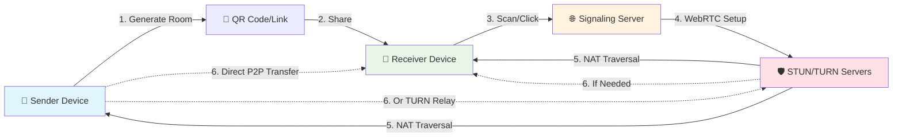
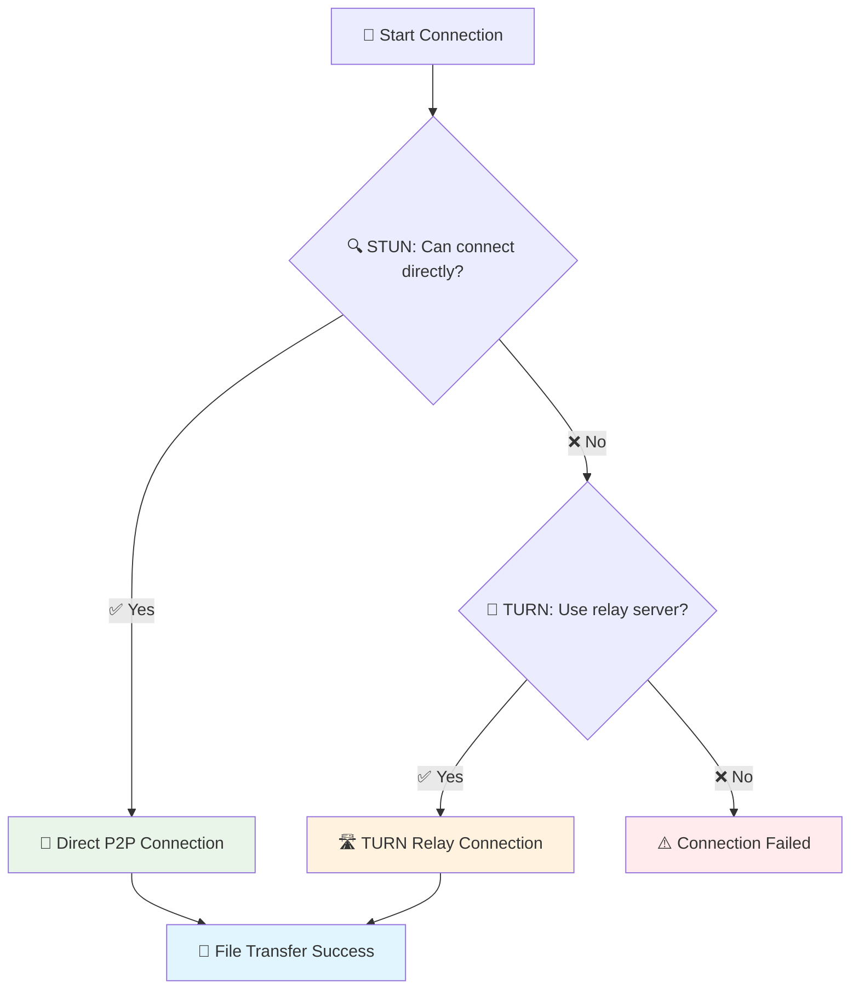

#  TransmitFlow

<div align="center">


**Send files instantly between devices without any servers storing your data - Seamless file transfer made simple.**
> **⚠️ Note:** Large file transfers (e.g., 1GB+) may use significant memory on your device. On mobile or low-RAM devices, very large transfers can cause performance issues or browser crashes. For best results, use chunked transfers and avoid sending extremely large files on mobile.

> **🔄 Updated: February 10, 2026 - Major reliability, security hardening, QR, and PWA upgrades**

[🚀 Live Demo](https://transmitflow.vercel.app) • [📖 Documentation](https://github.com/shubhampardule/transmitflow/wiki) • [🐛 Report Bug](https://github.com/shubhampardule/transmitflow/issues) • [✨ Request Feature](https://github.com/shubhampardule/transmitflow/issues)

> **Deployed on Vercel for fast, global delivery.**
</div>

---

## 🆕 2026 Release Highlights

### ✅ Reliability and Transfer Accuracy
- Binary-first transfer path with automatic compatibility fallback.
- Missing-chunk recovery and retransmission flow for incomplete transfers.
- Strict sender/receiver state handling to avoid conflicting final statuses.
- Final acknowledgment handshake so "completed" is shown only after confirmation.
- SHA-256 integrity verification during receive finalization.
- IndexedDB chunk storage support to reduce RAM pressure on large transfers.

### ✅ UX and Flow Improvements
- Improved cancel behavior for full transfer and individual files.
- Cleaner production-friendly status/error messages on both peers.
- Better reset and back-navigation behavior during active sessions.
- Refined loading/startup and transfer progress behavior.

### ✅ QR and Connection Improvements
- QR generation stabilized in sender flow.
- Receiver scanner parsing hardened for direct code, URL param, and fallback extraction.
- Scanner tuned for reliability across devices (`qr_code`, single-scan, rear camera).

### ✅ PWA and Offline Support
- Offline shell page and reconnect guidance.
- Service worker lifecycle improvements.
- Cache hardening so invite query params are not persisted in cache keys.
- Install prompt support for app-like mobile experience.

### ✅ Security Hardening (10/10 Completed)
- Event authorization + payload validation
- Abuse protection + rate limits
- Tight CORS allowlist
- Dependency patching + lockfile alignment
- Security headers + CSP
- Health endpoint exposure reduction
- TURN credential model hardening
- CSPRNG room code generation
- Production log sanitization
- Service worker cache hardening

## 🎯 Why TransmitFlow?

<table>
<tr>
<td width="50%">

### 🔒 **Complete Privacy**
- **Zero Server Storage** - Files never touch our servers
- **Direct P2P Connection** - Your data stays between your devices
- **End-to-End Transfer** - No intermediaries, no data mining

</td>
<td width="50%">

### ⚡ **Lightning Fast**
- **Direct Device Connection** - No upload/download bottlenecks
- **Real-time Progress** - Live transfer speeds and status
- **Smart Chunking** - Optimized for maximum throughput

</td>
</tr>
<tr>
<td width="50%">

### 🌐 **Universal Access**
- **No App Required** - Works in any modern browser
- **Cross-Platform** - Windows, Mac, Linux, iOS, Android
- **QR Code Magic** - Instant device pairing

</td>
<td width="50%">

### 🛠️ **Developer Friendly**
- **Modern Tech Stack** - Next.js 15.5.12, React 19.1.0, TypeScript 5+
- **Clean Architecture** - Well-documented, maintainable code
- **Open Source** - CC BY-NC 4.0 licensed, community-driven

</td>
</tr>
</table>

## ✨ Features & Screenshots

<div align="center">

### 📱 **App in Action - Dark & Light Themes**

<table>
<tr>
<td width="50%" align="center">

<br/>
<em>🌙 Dark Mode: Send & Receive Interface</em>
</td>
<td width="50%" align="center">

<br/>
<em>☀️ Light Mode: File Selection & App Features</em>
</td>
</tr>
<tr>
<td colspan="2" align="center">

<br/>
<em>📊 Real-time Transfer Progress with File Management</em>
</td>
</tr>
</table>

*Share files instantly with beautiful, responsive interface on any device!*

</div>

### 🔄 **Peer-to-Peer Transfer**
- 🎯 **Direct Device Communication**: Files transfer directly between devices using WebRTC
- 🔐 **No Server Storage**: Your files never touch our servers - complete privacy guaranteed
- 📊 **Real-time Progress**: Live transfer progress with speed monitoring and ETA
- 📁 **Multi-file Support**: Send multiple files in a single session with batch operations
- 🚀 **Optimized Performance**: Smart chunking for maximum transfer speeds

### 📱 **QR Code Sharing**
- ⚡ **Instant Connection**: Generate QR codes for easy device pairing in seconds
- 🌍 **Cross-Platform**: Works seamlessly between desktop, mobile, and tablets
- 📋 **One-Click Sharing**: Share connection links via clipboard or QR scan
- 🔗 **Smart URLs**: Direct links for easy sharing across messaging apps

### 🌟 **Current Version Highlights (2026 Stable)**

**✅ Platform and UX**
- 🚀 **Next.js 15.5.12 + React 19.1.0**: Updated framework stack
- 🎨 **shadcn/ui + Tailwind**: Modern, responsive, accessible UI
- 📱 **Reliable QR Flow**: Stronger generation + scanner parsing logic
- ⚡ **Turbopack Dev Flow**: Faster development feedback cycle
- 📊 **Vercel Speed Insights**: Production performance visibility

**✅ Transfer Engine Improvements**
- 🔄 **Binary-First Data Path**: Faster default transfer path
- 🔁 **Compatibility Fallback**: Base64 fallback when binary path is not stable
- 🧩 **Missing-Chunk Recovery**: Request/retry flow for incomplete receives
- ✅ **Final ACK State Convergence**: Sender/receiver completion is synchronized
- 🔐 **SHA-256 Integrity Checks**: File-level verification during finalize
- 💾 **IndexedDB Chunk Store**: Reduced memory pressure on larger receives

### 🛡️ **Security & Privacy**
- 🔒 **Direct WebRTC Transfer**: End-to-end peer transfer path
- 🚫 **No File Payload Storage on Signaling Server**
- 🔐 **Strict Signaling Validation + Authorization**
- 🧱 **Rate Limiting and Abuse Protection**
- 🌐 **Tight Production CORS Allowlist**
- 📋 **Security Headers + CSP Baseline**
- 🏥 **Safe Public Health + Protected Diagnostics Endpoint**
- 🎲 **CSPRNG Room Codes**
- 🧹 **Production Log Sanitization**
- 🗂️ **Service Worker Cache Hardening for Invite URLs**

### 🎯 **Smart Features**
- 🔍 **Auto-Discovery + Dynamic ICE Updates**
- ⏸️ **Cancel Individual File or Entire Transfer**
- 🔄 **Improved Reconnect and State Recovery**
- ⬅️ **Back-Navigation Safe Reset Behavior**
- 📱 **PWA Install + Offline Shell Experience**
- 📢 **Cleaner User Messages for Success/Cancel/Error**

### 💻 **Universal Compatibility**
- 🖥️ **All Platforms**: Windows, macOS, Linux, iOS, Android - everywhere
- 🌐 **Browser-Based**: No app installation required, works in any modern browser
- 📱 **Mobile Optimized**: Touch-friendly interface with gesture support
- 🔧 **Modern Standards**: Supports all major browsers with WebRTC capability

## 🚀 Quick Start

> **Get up and running in under 2 minutes!** 

### 📋 Prerequisites
- Node.js 18+ ([Download here](https://nodejs.org/))
- npm, yarn, or pnpm
- Modern browser with WebRTC support (Chrome, Firefox, Safari, Edge)

### ⚡ Installation

```bash
# 1️⃣ Clone the repository
git clone https://github.com/shubhampardule/transmitflow.git
cd transmitflow

# 2️⃣ Install dependencies
npm install

# 3️⃣ Set up environment variables
# Create .env manually (see Environment Variables section below)
# and configure signaling/TURN values as needed.

# 4️⃣ Start development server with Turbopack (faster builds)
npm run dev

# 🎉 Open http://localhost:3000 and start sharing!
```

> **Note**: If you run your own signaling server, deploy and configure it separately. If your signaling server lives in another repo, keep its version aligned with this frontend.

### 🏗️ Production Deployment

<details>
<summary><strong>📦 Build & Deploy Options</strong></summary>

#### **Vercel (Recommended)**
```bash
# Deploy to Vercel with one command
npx vercel --prod
```

#### **Self-Hosting**
```bash
# Build for production
npm run build

# Start production server
npm start
```

#### **Docker**
```bash
# Build Docker image
docker build -t p2p-file-transfer .

# Run container
docker run -p 3000:3000 p2p-file-transfer
```

</details>

## 🔧 How It Works

<div align="center">



</div>

### 🎬 **Step-by-Step Process**

<table>
<tr>
<td width="16%" align="center">

**1️⃣ Select Files**
<br/>
📁 Drag & drop or click to select files

</td>
<td width="16%" align="center">

**2️⃣ Generate QR Code**
<br/>
🔗 Create unique room & QR code

</td>
<td width="16%" align="center">

**3️⃣ Share Code**
<br/>
📱 Share QR code or link

</td>
<td width="16%" align="center">

**4️⃣ Signaling**
<br/>
🌐 Connect through signaling server

</td>
<td width="16%" align="center">

**5️⃣ NAT Traversal**
<br/>
🛡️ STUN/TURN handles network setup

</td>
<td width="16%" align="center">

**6️⃣ Transfer**
<br/>
🚀 Direct P2P or TURN relay

</td>
</tr>
</table>

### 🏗️ **Technical Architecture**

```
┌─────────────────┐    ┌─────────────────┐    ┌─────────────────┐
│   📱 Sender     │◄──►│ 🌐 Signaling    │◄──►│   📱 Receiver   │
│   Device        │    │   Server        │    │   Device        │
└─────────────────┘    └─────────────────┘    └─────────────────┘
         │                                              │
         └──────────── 🔗 Direct WebRTC P2P ──────────┘
                        (Encrypted File Transfer)
```

### ⚡ **Why This Approach?**

| Traditional Cloud | 🆚 | Our P2P Solution |
|:-----------------:|:--:|:----------------:|
| Upload → Server → Download | | Direct Device-to-Device |
| 📈 Server costs & storage | | 💰 Zero infrastructure costs |
| 🐌 Limited by server bandwidth | | ⚡ Full network speed |
| 🔓 Files stored on servers | | 🔒 Complete privacy |
| 📊 Data harvesting possible | | 🚫 No data collection |

## 🌐 Network Architecture: TURN/STUN Servers Explained

<div align="center">

**🤔 Ever wondered why some P2P apps fail to connect? We've got you covered!**

</div>

### 🛡️ **The NAT/Firewall Challenge**

Most devices today sit behind **NAT (Network Address Translation)** or firewalls, which can block direct P2P connections. Here's how we solve this:

<table>
<tr>
<td width="33%" align="center">

#### 🎯 **STUN Servers**
**"Session Traversal Utilities for NAT"**

🔍 **What it does:**
- Discovers your public IP address
- Determines your NAT type
- Helps establish direct connections

📡 **When used:**
- Both devices on same network
- Simple NAT configurations
- 70% of connections succeed

</td>
<td width="33%" align="center">

#### 🔄 **TURN Servers**
**"Traversal Using Relays around NAT"**

🛣️ **What it does:**
- Acts as a relay when direct connection fails
- Ensures 99.9% connection success
- Maintains P2P-like performance

🚨 **When needed:**
- Strict corporate firewalls
- Complex NAT configurations
- Mobile carrier restrictions

</td>
<td width="33%" align="center">

#### ⚡ **Our Implementation**

🔧 **Multi-server failover:**
- Primary: Direct P2P (STUN)
- Fallback: TURN relay
- Multiple TURN servers for reliability

✅ **Result:**
- **99.9% connection success rate**
- **Automatic fallback handling**
- **No user configuration required**

</td>
</tr>
</table>

### 🏗️ **Connection Flow**



### 🎯 **Why This Matters for You**

| 🌍 **Scenario** | 🔧 **Traditional P2P Apps** | ✅ **TransmitFlow** |
|:----------------|:----------------------------|:-------------------|
| **Home WiFi** | ✅ Usually works | ✅ Always works |
| **Office Network** | ❌ Often blocked by firewall | ✅ TURN relay ensures connection |
| **Mobile Data** | ❌ Carrier NAT issues | ✅ Automatic fallback to TURN |
| **Public WiFi** | ❌ Restricted networks | ✅ Multiple server options |
| **Different Countries** | ❌ Complex routing | ✅ Global TURN infrastructure |

> **💡 Pro Tip**: You never see this complexity! TransmitFlow automatically handles all the networking magic behind the scenes.

## 📸 User Journey Screenshots

<div align="center">

### **🎯 Complete File Transfer Experience**

<table>
<tr>
<td width="33%" align="center">

<br/>
<strong>1️⃣ Send Files</strong>
<br/>
<em>Choose files and generate QR code</em>
</td>
<td width="33%" align="center">

<br/>
<strong>2️⃣ Receive Files</strong>
<br/>
<em>Scan QR code or enter room code</em>
</td>
<td width="33%" align="center">

<br/>
<strong>3️⃣ Transfer Progress</strong>
<br/>
<em>Monitor real-time file transfer</em>
</td>
</tr>
</table>

**🌓 Seamless Dark/Light Theme Support** • **📱 Responsive on All Devices** • **🚀 Lightning Fast Transfers**

</div>

## 🛠️ Tech Stack & Architecture

<div align="center">

### **🚀 Modern Tech Stack**

| Layer | Technology | Purpose |
|:------|:-----------|:--------|
| 🎨 **Frontend** | Next.js 15.5.12 + React 19.1.0 | Latest web framework with React 19 concurrent features |
| 📱 **UI/UX** | Tailwind CSS + shadcn/ui | Modern design system with accessible components |
| 🔗 **P2P Engine** | WebRTC Data Channels | Direct peer-to-peer file transfer |
| 🌐 **Signaling** | Socket.IO 4.8.1 + Express 5.1.0 | Real-time connection coordination |
| 🛡️ **Type Safety** | TypeScript 5+ | Rock-solid code with compile-time checks |
| 🎯 **State Management** | React 19 Hooks + transfer state machine | Efficient state handling and consistent sender/receiver status |
| 📊 **Analytics** | Vercel Analytics & Speed Insights | Performance monitoring and user analytics |
| 🔍 **QR Scanning** | @yudiel/react-qr-scanner | Modern QR code scanning capabilities |

</div>

<details>
<summary><strong>📂 Detailed Project Structure</strong></summary>

```
p2p-react/
├── 🎯 src/
│   ├── 📱 app/                    # Next.js 15 App Router
│   │   ├── layout.tsx             # Root layout with providers
│   │   ├── page.tsx               # Main application page
│   │   ├── offline/page.tsx       # Offline fallback page
│   │   ├── globals.css            # Global styles & Tailwind
│   │   └── *.ico, *.svg          # App icons and assets
│   │
│   ├── 🧩 components/             # React components
│   │   ├── 🎨 ui/                 # shadcn/ui components
│   │   │   ├── button.tsx         # Button component
│   │   │   ├── card.tsx           # Card layouts
│   │   │   ├── tabs.tsx           # Tab navigation
│   │   │   ├── progress.tsx       # Progress bars
│   │   │   ├── badge.tsx          # Status badges
│   │   │   ├── input.tsx          # Input fields
│   │   │   ├── DelayedLoader.tsx  # Loading states
│   │   │   ├── LoadingSpinner.tsx # Spinner component
│   │   │   ├── ThemeToggle.tsx    # Theme switching
│   │   │   ├── PwaManager.tsx     # PWA install + online/offline banners
│   │   │   ├── ProductionLogGuard.tsx # Production client log guard
│   │   │   ├── TransmitFlowLogo.tsx # Main logo
│   │   │   └── TransmitFlowLogoOnly.tsx # Icon-only logo
│   │   │
│   │   ├── P2PFileTransfer.tsx    # 🔥 Main app logic & orchestration
│   │   ├── SendFilesPanel.tsx     # 📤 File upload interface with QR generation
│   │   ├── ReceiveFilesPanel.tsx  # 📥 File receive interface with QR scanning
│   │   ├── TransferProgress.tsx   # 📊 Real-time progress tracking
│   │   └── FloatingScrollButton.tsx # Smooth navigation helper
│   │
│   ├── 🔧 lib/                    # Core business logic
│   │   ├── webrtc.ts              # 🌐 WebRTC P2P engine with connection optimization
│   │   ├── signaling.ts           # 📡 Socket.IO client with enhanced error handling
│   │   ├── chunk-store.ts         # 💾 IndexedDB chunk persistence
│   │   ├── file-utils.ts          # 📁 File handling, chunking & validation
│   │   └── utils.ts               # 🛠️ Helper functions & utilities
│   │
│   └── 📝 types/                  # TypeScript definitions
│       └── index.ts               # Global type definitions & interfaces
│
├── 🌍 public/                     # Static assets
│   ├── sw.js                      # Service worker (PWA/offline cache logic)
│   ├── manifest.webmanifest       # PWA manifest
│   ├── *.svg                      # App icons (favicon, logos, etc.)
│   └── *.ico                      # Favicons
│
├── 📡 signaling-server.js          # Production signaling server with multi-TURN support
├── 📦 package.json                # Dependencies and scripts
├── 🏗️ next.config.js              # Next.js configuration with image optimization
├── 🎨 tailwind.config.js          # Tailwind CSS configuration
├── ⚙️ components.json             # shadcn/ui configuration
├── 🚀 vercel.json                 # Vercel deployment configuration
├── ⚙️ Procfile                    # Server deployment configuration
└── 🌐 .env                        # Environment variables (signaling server, TURN/STUN)
```

</details>

### 🔥 **Key Technical Components**

<table>
<tr>
<td width="50%">

#### **🌐 WebRTC Service** (`webrtc.ts`)
- 🔗 Manages peer-to-peer connections
- 📡 Handles control + binary data channel communication  
- 📦 Implements smart chunking with binary-first + fallback flow
- 🧩 Supports missing-chunk recovery/retry flow
- 🔐 Performs SHA-256 file integrity verification
- 💾 Supports IndexedDB-backed chunk persistence for larger files
- 📊 Real-time progress tracking + synchronized terminal state handling

</td>
<td width="50%">

#### **📡 Signaling Service** (`signaling.ts`)
- 🌐 WebSocket-based peer discovery
- 🏠 Secure room management
- 🤝 WebRTC offer/answer exchange
- 🧊 ICE candidate coordination
- 🔁 Dynamic TURN/STUN update handling from signaling server
- ⏱️ Connection timeout and reconnection handling

</td>
</tr>
<tr>
<td width="50%">

#### **📱 Enhanced UI Components**
- **SendFilesPanel**: Drag & drop with live preview and QR generation
- **ReceiveFilesPanel**: Advanced QR scanner with auto-connect
- **TransferProgress**: Real-time progress with individual file management
- **DelayedLoader**: Smooth loading states with optimized UX
- **FloatingScrollButton**: Smart navigation with scroll detection
- **ThemeToggle**: Dark/light mode switching (if implemented)
- **TransmitFlowLogo**: Branded logo components for consistent UI

</td>
<td width="50%">

#### **🛠️ Enhanced Utilities**
- **File Processing**: Advanced chunking, validation & metadata extraction
- **QR Code Generation**: Dynamic QR codes with error correction
- **Error Handling**: Comprehensive error management & recovery
- **Performance**: Optimized for large files with adaptive chunk behavior and persistent chunk storage
- **Analytics Integration**: Vercel Analytics & Speed Insights
- **Environment Configuration**: Multi-environment support with TURN/STUN and security controls

</td>
</tr>
</table>

## 📱 Usage Guide

### 🚀 **Sending Files** (Super Easy!)

<details>
<summary><strong>👆 Click to see step-by-step guide</strong></summary>

1. **🌐 Open the App**: Visit the website in any browser
2. **📁 Select Files**: 
   - Drag & drop files into the upload area, OR
   - Click "Select Files" to browse your device
3. **🚀 Start Sharing**: Click the "Start Sharing" button
4. **📱 Share Connection**: 
   - Show the QR code to the receiver, OR
   - Copy and share the link via message/email
5. **⏳ Wait for Connection**: Receiver will connect automatically
6. **📊 Monitor Progress**: Watch real-time transfer progress

</details>

### 📥 **Receiving Files** (Even Easier!)

<details>
<summary><strong>👆 Click to see step-by-step guide</strong></summary>

1. **📱 Get the Code**: Receive QR code or link from sender
2. **🔗 Connect**: 
   - Scan QR code with your camera, OR
   - Click the shared link, OR
   - Enter room code manually in "Receive" tab
3. **⚡ Auto-Connect**: Connection happens automatically
4. **📥 Receive Files**: Files transfer directly to your device
5. **💾 Download**: Download files individually or all at once

</details>

### 💡 **Pro Tips**

<div align="center">

| 💡 **Tip** | 📝 **Description** |
|:-----------|:-------------------|
| 🔗 **Share Links** | Copy the URL after starting sharing - works like QR codes! |
| 📱 **Mobile First** | Use your phone's camera to scan QR codes instantly |
| 🚀 **Speed Boost** | Connect devices to same WiFi network for maximum speed |
| 🔄 **Multi-Send** | Select multiple files at once for batch transfers |
| ⏸️ **Pause Control** | Cancel individual files without stopping entire transfer |
| 🔒 **Privacy Mode** | Use in incognito/private browsing for extra privacy |

</div>

## 🔒 Security & Privacy

<div align="center">

### 🛡️ **Your Privacy is Our Priority**


</div>

### 🛡️ **Security Architecture**

| 🔐 **Feature** | 📝 **Implementation** |
|:----------------|:----------------------|
| **🚫 Zero Server Storage** | Files stream directly between devices via WebRTC |
| **⏱️ Temporary Sessions** | Room codes auto-expire after transfers complete |
| **🔐 Secure Signaling Path** | Strict payload validation + role/room authorization checks |
| **🏠 Isolated Rooms** | Each transfer gets unique, private room code |
| **🌐 CORS and Abuse Controls** | Tight allowlist CORS, per-IP/per-socket rate limits, payload size limits |
| **🧱 Browser Sandbox + CSP** | Secure browser sandbox with security headers and baseline CSP |
| **🏥 Health Endpoint Hardening** | Public liveness only + protected diagnostics endpoint |
| **🧹 Production Log Hygiene** | Sensitive runtime context suppressed/sanitized in production |
| **📖 Open Source** | Full code transparency for community security audits |

### ✅ **Security Hardening Status**

All planned 10 hardening items are completed in this repo (event auth, abuse controls, CORS tightening, dependency patching, headers/CSP, health endpoint split, TURN model hardening, CSPRNG room codes, log sanitization, service worker cache hardening).

### 🔧 **Development Environment**

**🛠️ Setup Requirements**
- **Node.js 18+** with npm for package management
- **Modern Browser** for testing (Chrome, Firefox, Safari, Edge)

**⚡ Quick Start**
```bash
# Clone and install
git clone https://github.com/shubhampardule/transmitflow.git
cd transmitflow
npm install

# Start development server with Turbopack
npm run dev
```

**🚀 Key Technologies**
- **Framework**: Next.js 15.5.12 with App Router and Turbopack
- **UI**: React 19.1.0 + TypeScript 5+ + Tailwind CSS + shadcn/ui
- **P2P**: WebRTC + Socket.IO 4.8.1 for real-time communication
- **Tools**: @yudiel/react-qr-scanner, Vercel Analytics, ESLint 9

## 🔧 Troubleshooting

### **Common Issues & Solutions**

| 🚨 **Issue** | 🔧 **Solution** |
|:-------------|:----------------|
| **Files won't transfer** | Confirm both peers are connected and signaling server is reachable. Check firewall/NAT restrictions on WebRTC traffic. |
| **Transfer incomplete / missing chunks** | Retry transfer with stable network on both sides. Keep both tabs active until final completion confirmation. |
| **Sender/receiver status mismatch** | Update both sides to latest build and ensure signaling server is also updated to matching protocol changes. |
| **QR code won't scan** | Confirm camera permission, improve lighting, hold steady, or use manual room code entry as fallback. |
| **Large files fail on mobile** | Use smaller batches on low-memory devices. IndexedDB helps, but very large files can still hit browser limits. |
| **Slow transfer speeds** | Prefer same WiFi network and avoid VPN/proxy paths when possible. TURN relay routes may be slower than direct P2P. |

### **Browser & Platform Support**
- ✅ **Chrome/Chromium 90+**: Full support with best performance
- ✅ **Firefox 88+**: Full support with excellent compatibility  
- ✅ **Safari 14+**: Full support on macOS and iOS
- ✅ **Edge 90+**: Full support on Windows
- ✅ **Mobile browsers**: Supported, but practical limits depend on device memory and browser behavior
- ✅ **Cross-Platform**: Windows, macOS, Linux, iOS, Android - works everywhere

### **Performance Optimization**
- Use WiFi instead of mobile data for fastest transfers
- Close other browser tabs during large file transfers
- Ensure both devices have sufficient battery and stable connection
- Keep signaling + frontend versions aligned when deploying from separate repos

## 🚀 Deployment

### **Development**
```bash
# Start development server with Turbopack
npm run dev

# Build for production
npm run build

# Preview production build locally
npm start
```

### **Production (Vercel - Recommended)**
```bash
# Deploy to Vercel with one command
vercel --prod

# Or deploy via GitHub integration
# Just push to main branch and Vercel auto-deploys
```

### **Environment Variables**
Create a `.env` file with your configuration:
```env
NEXT_PUBLIC_SIGNALING_SERVER_URL=https://your-signaling-server.com

# Client WebRTC ICE config (comma-separated lists supported)
NEXT_PUBLIC_TURN_URLS=turn:your-turn-server.com:3478?transport=udp,turn:your-turn-server.com:3478?transport=tcp
NEXT_PUBLIC_TURN_USER=your-username
NEXT_PUBLIC_TURN_PASS=your-password
NEXT_PUBLIC_STUN_URLS=stun:your-stun-server.com:3478,stun:stun.l.google.com:19302
NEXT_PUBLIC_ENABLE_CLIENT_LOGS=false

# Signaling server (server-side only; do NOT expose publicly)
TURN_URLS=turn:your-turn-server.com:3478?transport=udp,turn:your-turn-server.com:3478?transport=tcp
TURN_USERNAME=your-username
TURN_CREDENTIAL=your-password
STUN_URLS=stun:your-stun-server.com:3478
ALLOW_INSECURE_PUBLIC_TURN_FALLBACK=false
SIGNALING_HEALTH_DIAGNOSTICS_TOKEN=replace-with-strong-random-token
SIGNALING_CORS_ALLOWED_ORIGINS=https://your-frontend-domain.com
SIGNALING_DEV_CORS_ALLOWED_ORIGINS=http://localhost:3000
SIGNALING_LOG_LEVEL=info
NODE_ENV=production
```

### **Self-Hosting**
```bash
# Clone and setup
git clone https://github.com/shubhampardule/transmitflow.git
cd transmitflow
npm install

# Build and start
npm run build
npm start

# Or use PM2 for production
npm install -g pm2
pm2 start npm --name "transmitflow" -- start
```

## 🤝 Contributing

<div align="center">

**We ❤️ contributions! Join our community of developers making file sharing better for everyone.**

[](https://github.com/shubhampardule/transmitflow/graphs/contributors)
[](https://github.com/shubhampardule/transmitflow/network/members)
[](https://github.com/shubhampardule/transmitflow/stargazers)

</div>

### 🚀 **Quick Contribution Setup**

```bash
# 1️⃣ Fork the repository on GitHub

# 2️⃣ Clone your fork
git clone https://github.com/YOUR-USERNAME/transmitflow.git
cd transmitflow

# 3️⃣ Create a feature branch
git checkout -b feature/amazing-new-feature

# 4️⃣ Make your changes and commit
git commit -m "✨ Add amazing new feature"

# 5️⃣ Push to your fork and create a Pull Request
git push origin feature/amazing-new-feature
```

### 🎯 **How You Can Help**

<table>
<tr>
<td width="33%">

#### 🐛 **Bug Reports**
Found a bug? Help us fix it!
- Use our bug report template
- Include steps to reproduce
- Add screenshots if applicable

</td>
<td width="33%">

#### ✨ **Feature Requests**
Have a cool idea? We'd love to hear it!
- Check existing feature requests
- Describe your use case
- Explain the benefits

</td>
<td width="33%">

#### 📝 **Documentation**
Help others understand the project!
- Fix typos and grammar
- Add examples and tutorials
- Improve API documentation

</td>
</tr>
</table>

### 🏆 **Recognition**

All contributors get:
- 🎉 Listed in our contributors section
- 🏷️ Credit in release notes for their contributions
- 🌟 Special recognition for significant contributions
- 📫 Priority support for their issues

<details>
<summary><strong>📋 Contribution Guidelines</strong></summary>

#### **Code Style**
- Use TypeScript for type safety
- Follow existing code formatting
- Add tests for new features
- Update documentation

#### **Commit Messages**
- Use conventional commits format
- Start with emoji for visual clarity
- Be descriptive but concise

#### **Pull Request Process**
1. Update the README.md with details of changes
2. Increase version numbers if applicable
3. Get approval from maintainers
4. Merge will be handled by maintainers

</details>

## 💬 Support & Community

<div align="center">

### 🤗 **Get Help & Connect**

[](https://discord.gg/your-discord)
[](https://github.com/shubhampardule/transmitflow/discussions)
[](https://github.com/shubhampardule/transmitflow/wiki)
[](https://buymeacoffee.com/shubhampardule)

</div>

### 🆘 **Need Help?**

| 💭 **Type** | 🔗 **Where to Go** | ⏱️ **Response Time** |
|:------------|:-------------------|:---------------------|
| 🐛 **Bug Reports** | [GitHub Issues](https://github.com/shubhampardule/transmitflow/issues) | Usually within 24 hours |
| 💡 **Feature Requests** | [GitHub Issues](https://github.com/shubhampardule/transmitflow/issues) | Weekly review cycle |
| ❓ **Questions** | [GitHub Discussions](https://github.com/shubhampardule/transmitflow/discussions) | Community-powered |
| 💬 **Chat** | [Discord Server](https://discord.gg/your-discord) | Real-time |
| 📖 **Documentation** | [Project Wiki](https://github.com/shubhampardule/transmitflow/wiki) | Always available |

### 🌟 **Show Your Support**

<div align="center">

**If this project helped you, consider:**

[](https://github.com/shubhampardule/transmitflow)
[](https://buymeacoffee.com/shubhampardule)
[](https://twitter.com/intent/tweet?text=Check%20out%20this%20awesome%20P2P%20file%20transfer%20app!&url=https://github.com/shubhampardule/transmitflow&via=ShubhamPardule)

</div>

---

## 📄 License

<div align="center">

This project is licensed under the **Creative Commons Attribution-NonCommercial 4.0 International (CC BY-NC 4.0)** - see the [LICENSE](LICENSE) file for details.

**TL;DR**: You can use, share, and modify this project for **non-commercial purposes only**, as long as you provide attribution to the original author.

**✅ Allowed:**
- Personal use
- Educational use
- Sharing and redistribution
- Modifications and adaptations

**❌ Not Allowed:**
- Commercial use
- Selling or monetizing the software

</div>

---

## 🙏 Acknowledgments

<div align="center">

**Built with ❤️ using amazing open-source technologies**

### 💝 **Special Thanks**

- All our amazing [contributors](https://github.com/shubhampardule/transmitflow/graphs/contributors)
- The open-source community for continuous inspiration
- Everyone who provided feedback and suggestions
- The developers of WebRTC, Next.js, and all the incredible tools that make this project possible

</div>

---

<div align="center">

**[⭐ Star this repo](https://github.com/shubhampardule/transmitflow)** if you find it useful!

**Made with ❤️ by [shubhampardule](https://github.com/shubhampardule)**

### 🚀 *Share files freely, privately, and instantly!*

</div>
