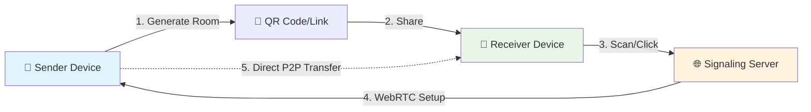

# � TransmitFlow

<div align="center">


**Send files instantly between devices without any servers storing your data - Seamless file transfer made simple.**

[🚀 Live Demo](https://transmitflow.com) • [📖 Documentation](https://github.com/10neWOlF/transmitflow/wiki) • [🐛 Report Bug](https://github.com/10neWOlF/transmitflow/issues) • [✨ Request Feature](https://github.com/10neWOlF/transmitflow/issues)

> **Deployed on Vercel for fast, global delivery.**
</div>

---

## 🎯 Why TransmitFlow?

<table>
<tr>
<td width="50%">

### 🔒 **Complete Privacy**
- **Zero Server Storage** - Files never touch our servers
- **Direct P2P Connection** - Your data stays between your devices
- **End-to-End Transfer** - No intermediaries, no data mining

</td>
<td width="50%">

### ⚡ **Lightning Fast**
- **Direct Device Connection** - No upload/download bottlenecks
- **Real-time Progress** - Live transfer speeds and status
- **Smart Chunking** - Optimized for maximum throughput

</td>
</tr>
<tr>
<td width="50%">

### 🌐 **Universal Access**
- **No App Required** - Works in any modern browser
- **Cross-Platform** - Windows, Mac, Linux, iOS, Android
- **QR Code Magic** - Instant device pairing

</td>
<td width="50%">

### 🛠️ **Developer Friendly**
- **Modern Tech Stack** - Next.js 15, React 19, TypeScript
- **Clean Architecture** - Well-documented, maintainable code
- **Open Source** - MIT licensed, community-driven

</td>
</tr>
</table>

## ✨ Features

<div align="center">


*Share files instantly with just a QR code scan!*

</div>

### 🔄 **Peer-to-Peer Transfer**
- 🎯 **Direct Device Communication**: Files transfer directly between devices using WebRTC
- 🔐 **No Server Storage**: Your files never touch our servers - complete privacy guaranteed
- 📊 **Real-time Progress**: Live transfer progress with speed monitoring and ETA
- 📁 **Multi-file Support**: Send multiple files in a single session with batch operations
- 🚀 **Optimized Performance**: Smart chunking for maximum transfer speeds

### 📱 **QR Code Sharing**
- ⚡ **Instant Connection**: Generate QR codes for easy device pairing in seconds
- 🌍 **Cross-Platform**: Works seamlessly between desktop, mobile, and tablets
- 📋 **One-Click Sharing**: Share connection links via clipboard or QR scan
- 🔗 **Smart URLs**: Direct links for easy sharing across messaging apps

### 🛡️ **Security & Privacy**
- 🔒 **End-to-End Transfer**: Direct peer-to-peer connection with no middleman
- 🚫 **No Data Storage**: Files are never stored on servers - ever
- 🔐 **Secure Signaling**: Encrypted WebRTC signaling server for safe connections
- 🏠 **Room-based Sessions**: Temporary, secure transfer rooms that auto-expire

### 🎯 **Smart Features**
- 🔍 **Auto-Discovery**: Automatic device detection and connection establishment
- ⏸️ **Transfer Management**: Cancel individual files or entire transfers mid-stream
- 🔄 **Connection Recovery**: Automatic reconnection on network issues
- ⬅️ **Smart Navigation**: Intelligent browser back button handling
- 📱 **Responsive Design**: Perfect experience on any device size

### 💻 **Universal Compatibility**
- 🖥️ **All Platforms**: Windows, macOS, Linux, iOS, Android - everywhere
- 🌐 **Browser-Based**: No app installation required, works in any modern browser
- 📱 **Mobile Optimized**: Touch-friendly interface with gesture support
- 🔧 **Modern Standards**: Supports all major browsers with WebRTC capability

## 🚀 Quick Start

> **Get up and running in under 2 minutes!** 

### 📋 Prerequisites
- Node.js 18+ ([Download here](https://nodejs.org/))
- npm, yarn, or pnpm
- Modern browser with WebRTC support

### ⚡ Installation

```bash
# 1️⃣ Clone the repository
git clone https://github.com/10neWOlF/transmitflow.git
cd transmitflow

# 2️⃣ Install dependencies
npm install

# 3️⃣ Start development server
npm run dev

# 🎉 Open http://localhost:3000 and start sharing!
```

### 🏗️ Production Deployment

<details>
<summary><strong>📦 Build & Deploy Options</strong></summary>

#### **Vercel (Recommended)**
```bash
# Deploy to Vercel with one command
npx vercel --prod
```

#### **Self-Hosting**
```bash
# Build for production
npm run build

# Start production server
npm start
```

#### **Docker**
```bash
# Build Docker image
docker build -t p2p-file-transfer .

# Run container
docker run -p 3000:3000 p2p-file-transfer
```

</details>

## 🔧 How It Works

<div align="center">



</div>

### 🎬 **Step-by-Step Process**

<table>
<tr>
<td width="20%" align="center">

**1️⃣ Select Files**
<br/>
📁 Drag & drop or click to select files

</td>
<td width="20%" align="center">

**2️⃣ Generate QR Code**
<br/>
🔗 Create unique room & QR code

</td>
<td width="20%" align="center">

**3️⃣ Share Code**
<br/>
📱 Share QR code or link

</td>
<td width="20%" align="center">

**4️⃣ Connect**
<br/>
🤝 Automatic P2P connection

</td>
<td width="20%" align="center">

**5️⃣ Transfer**
<br/>
🚀 Direct file transfer

</td>
</tr>
</table>

### 🏗️ **Technical Architecture**

```
┌─────────────────┐    ┌─────────────────┐    ┌─────────────────┐
│   📱 Sender     │◄──►│ 🌐 Signaling    │◄──►│   📱 Receiver   │
│   Device        │    │   Server        │    │   Device        │
└─────────────────┘    └─────────────────┘    └─────────────────┘
         │                                              │
         └──────────── 🔗 Direct WebRTC P2P ──────────┘
                        (Encrypted File Transfer)
```

### ⚡ **Why This Approach?**

| Traditional Cloud | 🆚 | Our P2P Solution |
|:-----------------:|:--:|:----------------:|
| Upload → Server → Download | | Direct Device-to-Device |
| 📈 Server costs & storage | | 💰 Zero infrastructure costs |
| 🐌 Limited by server bandwidth | | ⚡ Full network speed |
| 🔓 Files stored on servers | | 🔒 Complete privacy |
| 📊 Data harvesting possible | | 🚫 No data collection |

## 🛠️ Tech Stack & Architecture

<div align="center">

### **🚀 Modern Tech Stack**

| Layer | Technology | Purpose |
|:------|:-----------|:--------|
| 🎨 **Frontend** | Next.js 15 + React 19 | Modern web framework with latest features |
| 📱 **UI/UX** | Tailwind CSS + Radix UI | Beautiful, accessible, responsive design |
| 🔗 **P2P Engine** | WebRTC Data Channels | Direct peer-to-peer file transfer |
| 🌐 **Signaling** | Socket.IO + Express.js | Real-time connection coordination |
| 🛡️ **Type Safety** | TypeScript | Rock-solid code with compile-time checks |
| 🎯 **State Management** | React Hooks | Simple, efficient state handling |

</div>

<details>
<summary><strong>📂 Detailed Project Structure</strong></summary>

```
p2p-react/
├── 🎯 src/
│   ├── 📱 app/                    # Next.js 15 App Router
│   │   ├── layout.tsx             # Root layout with providers
│   │   ├── page.tsx               # Main application page
│   │   └── globals.css            # Global styles
│   │
│   ├── 🧩 components/             # React components
│   │   ├── 🎨 ui/                 # Reusable UI primitives
│   │   │   ├── button.tsx         # Button component
│   │   │   ├── card.tsx           # Card layouts
│   │   │   ├── tabs.tsx           # Tab navigation
│   │   │   └── progress.tsx       # Progress bars
│   │   │
│   │   ├── P2PFileTransfer.tsx    # 🔥 Main app logic
│   │   ├── SendFilesPanel.tsx     # 📤 File upload interface
│   │   ├── ReceiveFilesPanel.tsx  # 📥 File receive interface
│   │   ├── TransferProgress.tsx   # 📊 Progress tracking
│   │   └── FloatingScrollButton.tsx # Navigation helper
│   │
│   ├── 🔧 lib/                    # Core business logic
│   │   ├── webrtc.ts              # 🌐 WebRTC P2P engine
│   │   ├── signaling.ts           # 📡 Socket.IO client
│   │   ├── file-utils.ts          # 📁 File handling utilities
│   │   └── utils.ts               # 🛠️ Helper functions
│   │
│   └── 📝 types/                  # TypeScript definitions
│       └── index.ts               # Global type definitions
│
├── 🌍 public/                     # Static assets
│   ├── icons/                     # App icons
│   └── images/                    # Images and graphics
│
├── 🖥️ server.js                   # Production server
├── 📡 signaling-server.js          # WebRTC signaling server
└── 📦 package.json                # Dependencies and scripts
```

</details>

### 🔥 **Key Technical Components**

<table>
<tr>
<td width="50%">

#### **🌐 WebRTC Service** (`webrtc.ts`)
- 🔗 Manages peer-to-peer connections
- 📡 Handles data channel communication  
- 📦 Implements smart file chunking
- 📊 Real-time progress tracking
- 🔄 Automatic reconnection logic

</td>
<td width="50%">

#### **📡 Signaling Service** (`signaling.ts`)
- 🌐 WebSocket-based peer discovery
- 🏠 Secure room management
- 🤝 WebRTC offer/answer exchange
- 🧊 ICE candidate coordination
- ⏱️ Connection timeout handling

</td>
</tr>
<tr>
<td width="50%">

#### **📱 UI Components**
- **SendFilesPanel**: Drag & drop with preview
- **ReceiveFilesPanel**: QR scanner & room joining
- **TransferProgress**: Live progress monitoring
- **Smart Navigation**: Browser history management

</td>
<td width="50%">

#### **🛠️ Utilities**
- **File Processing**: Chunking, validation, metadata
- **QR Code Generation**: Dynamic link creation
- **Error Handling**: Graceful failure management
- **Performance**: Optimized for large files

</td>
</tr>
</table>

## 📱 Usage Guide

### 🚀 **Sending Files** (Super Easy!)

<details>
<summary><strong>👆 Click to see step-by-step guide</strong></summary>

1. **🌐 Open the App**: Visit the website in any browser
2. **📁 Select Files**: 
   - Drag & drop files into the upload area, OR
   - Click "Select Files" to browse your device
3. **🚀 Start Sharing**: Click the "Start Sharing" button
4. **📱 Share Connection**: 
   - Show the QR code to the receiver, OR
   - Copy and share the link via message/email
5. **⏳ Wait for Connection**: Receiver will connect automatically
6. **📊 Monitor Progress**: Watch real-time transfer progress

</details>

### 📥 **Receiving Files** (Even Easier!)

<details>
<summary><strong>👆 Click to see step-by-step guide</strong></summary>

1. **📱 Get the Code**: Receive QR code or link from sender
2. **🔗 Connect**: 
   - Scan QR code with your camera, OR
   - Click the shared link, OR
   - Enter room code manually in "Receive" tab
3. **⚡ Auto-Connect**: Connection happens automatically
4. **📥 Receive Files**: Files transfer directly to your device
5. **💾 Download**: Download files individually or all at once

</details>

### 💡 **Pro Tips**

<div align="center">

| 💡 **Tip** | 📝 **Description** |
|:-----------|:-------------------|
| 🔗 **Share Links** | Copy the URL after starting sharing - works like QR codes! |
| 📱 **Mobile First** | Use your phone's camera to scan QR codes instantly |
| 🚀 **Speed Boost** | Connect devices to same WiFi network for maximum speed |
| 🔄 **Multi-Send** | Select multiple files at once for batch transfers |
| ⏸️ **Pause Control** | Cancel individual files without stopping entire transfer |
| 🔒 **Privacy Mode** | Use in incognito/private browsing for extra privacy |

</div>

## 🔒 Security & Privacy Features

<div align="center">

### 🛡️ **Your Privacy is Our Priority**


</div>

| 🔐 **Security Feature** | 📝 **How It Works** | 🎯 **Benefit** |
|:------------------------|:---------------------|:----------------|
| **🚫 Zero Server Storage** | Files never touch our servers | Complete data ownership |
| **🔗 Direct P2P Transfer** | WebRTC creates direct device connection | No intermediary access |
| **⏱️ Temporary Sessions** | Rooms auto-expire after transfers | No persistent data |
| **🔐 Encrypted Signaling** | WebSocket connections are secured | Safe connection setup |
| **🏠 Isolated Rooms** | Each transfer gets unique room code | No cross-session access |
| **🌐 Browser Sandbox** | Runs in secure browser environment | OS-level protection |
| **🔍 No Analytics** | Zero tracking or data collection | Complete anonymity |
| **📖 Open Source** | Full code transparency | Community-verified security |

### 🚨 **What We DON'T Do**

<div align="center">

| ❌ **Never** | ✅ **Always** |
|:-------------|:--------------|
| Store your files on servers | Direct device-to-device transfer |
| Track your usage or data | Respect your complete privacy |
| Require account registration | Work anonymously |
| Collect personal information | Zero data collection |
| Share data with third parties | Local-only processing |
| Keep transfer histories | Clean slate every time |

</div>

## 🌟 Advanced Features

### **Smart Navigation**
- Browser back button returns to previous app state
- URL state management for sharing links
- Prevents accidental navigation during transfers

### **Transfer Management**
- Individual file cancellation
- Batch transfer operations
- Connection state monitoring
- Automatic retry mechanisms

### **Responsive Design**
- Mobile-optimized interface
- Touch-friendly interactions
- Adaptive layouts for all screen sizes
- Cross-platform consistency

## 🚀 Deployment

### **Development**
```bash
npm run dev
```

### **Production (Vercel)**
```bash
# Deploy to Vercel
vercel --prod
```

### **Self-Hosting**
```bash
# Build and start
npm run build
npm start

# Or use PM2
pm2 start ecosystem.config.js
```

## 🤝 Contributing

<div align="center">

**We ❤️ contributions! Join our community of developers making file sharing better for everyone.**

[](https://github.com/10neWOlF/transmitflow/graphs/contributors)
[](https://github.com/10neWOlF/transmitflow/network/members)
[](https://github.com/10neWOlF/transmitflow/stargazers)

</div>

### 🚀 **Quick Contribution Setup**

```bash
# 1️⃣ Fork the repository on GitHub

# 2️⃣ Clone your fork
git clone https://github.com/YOUR-USERNAME/transmitflow.git
cd transmitflow

# 3️⃣ Create a feature branch
git checkout -b feature/amazing-new-feature

# 4️⃣ Make your changes and commit
git commit -m "✨ Add amazing new feature"

# 5️⃣ Push to your fork and create a Pull Request
git push origin feature/amazing-new-feature
```

### 🎯 **How You Can Help**

<table>
<tr>
<td width="33%">

#### 🐛 **Bug Reports**
Found a bug? Help us fix it!
- Use our bug report template
- Include steps to reproduce
- Add screenshots if applicable

</td>
<td width="33%">

#### ✨ **Feature Requests**
Have a cool idea? We'd love to hear it!
- Check existing feature requests
- Describe your use case
- Explain the benefits

</td>
<td width="33%">

#### 📝 **Documentation**
Help others understand the project!
- Fix typos and grammar
- Add examples and tutorials
- Improve API documentation

</td>
</tr>
</table>

### 🏆 **Recognition**

All contributors get:
- 🎉 Listed in our contributors section
- 🏷️ Credit in release notes for their contributions
- 🌟 Special recognition for significant contributions
- 📫 Priority support for their issues

<details>
<summary><strong>📋 Contribution Guidelines</strong></summary>

#### **Code Style**
- Use TypeScript for type safety
- Follow existing code formatting
- Add tests for new features
- Update documentation

#### **Commit Messages**
- Use conventional commits format
- Start with emoji for visual clarity
- Be descriptive but concise

#### **Pull Request Process**
1. Update the README.md with details of changes
2. Increase version numbers if applicable
3. Get approval from maintainers
4. Merge will be handled by maintainers

</details>

## � Support & Community

<div align="center">

### 🤗 **Get Help & Connect**

[](https://discord.gg/your-discord)
[](https://github.com/10neWOlF/transmitflow/discussions)
[](https://github.com/10neWOlF/transmitflow/wiki)

</div>

### 🆘 **Need Help?**

| 💭 **Type** | 🔗 **Where to Go** | ⏱️ **Response Time** |
|:------------|:-------------------|:---------------------|
| 🐛 **Bug Reports** | [GitHub Issues](https://github.com/10neWOlF/transmitflow/issues) | Usually within 24 hours |
| 💡 **Feature Requests** | [GitHub Issues](https://github.com/10neWOlF/transmitflow/issues) | Weekly review cycle |
| ❓ **Questions** | [GitHub Discussions](https://github.com/10neWOlF/transmitflow/discussions) | Community-powered |
| 💬 **Chat** | [Discord Server](https://discord.gg/your-discord) | Real-time |
| 📖 **Documentation** | [Project Wiki](https://github.com/10neWOlF/transmitflow/wiki) | Always available |

### 🌟 **Show Your Support**

<div align="center">

**If this project helped you, consider:**

[](https://github.com/10neWOlF/transmitflow)
[](https://twitter.com/intent/tweet?text=Check%20out%20this%20awesome%20P2P%20file%20transfer%20app!&url=https://github.com/10neWOlF/transmitflow&via=ShubhamPardule)

</div>

---

## �📄 License

<div align="center">

This project is licensed under the **MIT License** - see the [LICENSE](LICENSE) file for details.

**TL;DR**: You can use this project for anything you want, including commercial use, as long as you include the original license.

</div>

---

## 🙏 Acknowledgments

<div align="center">

**Built with ❤️ using amazing open-source technologies:**

</div>

- 🌐 **[WebRTC](https://webrtc.org/)** - For enabling peer-to-peer magic
- ⚛️ **[Next.js](https://nextjs.org/)** - The React framework that makes everything possible
- 🎨 **[Tailwind CSS](https://tailwindcss.com/)** - For beautiful, responsive styling
- 🧩 **[Radix UI](https://www.radix-ui.com/)** - For accessible, unstyled components
- 📡 **[Socket.IO](https://socket.io/)** - For real-time signaling communication
- 📱 **[QR Code Libraries](https://github.com/soldair/node-qrcode)** - For seamless device pairing

### 💝 **Special Thanks**

- All our amazing [contributors](https://github.com/10neWOlF/transmitflow/graphs/contributors)
- The open-source community for continuous inspiration
- Everyone who provided feedback and suggestions

---

<div align="center">

**[⭐ Star this repo](https://github.com/10neWOlF/transmitflow)** if you find it useful!

**Made with ❤️ by [10neWOlF](https://github.com/10neWOlF)**

### 🚀 *Share files freely, privately, and instantly!*

</div>
