#  TransmitFlow

<div align="center">


**Send files instantly between devices — no servers store your data.**

[🚀 Live Demo](https://transmitflow.vercel.app) · [📖 Architecture](docs/ARCHITECTURE.md) · [🐛 Report Bug](https://github.com/shubhampardule/transmitflow/issues) · [✨ Request Feature](https://github.com/shubhampardule/transmitflow/issues)

</div>

---

## Latest Release (v0.2.0)

- Room flow hardening completed (steps 18–23) with clearer recovery actions and safer retries.
- Sender retry now creates a new room code after timeout/failure instead of reusing expired codes.
- Sharing flow improved with copy code/link actions, QR controls, and clearer transfer-state messaging.
- Mobile transfer UX refined for action visibility, file readability, and reduced scroll friction.
- Accessibility and comfort improvements added: stronger keyboard focus behavior and reduced-motion support.

## Screenshots

<div align="center">
<table>
<tr>
<td width="33%" align="center">

<br/><strong>Send Files</strong>
<br/><em>Select files & share QR code</em>
</td>
<td width="33%" align="center">

<br/><strong>Receive Files</strong>
<br/><em>Scan QR or enter room code</em>
</td>
<td width="33%" align="center">

<br/><strong>Transfer Progress</strong>
<br/><em>Real-time progress per file</em>
</td>
</tr>
</table>
</div>

## Features

- **Direct P2P Transfer** — Files go straight between devices via WebRTC. Nothing stored on any server.
- **QR Code Pairing** — Sender generates a QR code; receiver scans it to connect instantly.
- **Cross-Platform** — Works in any modern browser on Windows, Mac, Linux, iOS, Android. No app install needed.
- **Multi-File & Batch Transfer** — Select multiple files, monitor each one individually.
- **Adaptive Chunking** — 64–128 KB chunks with backpressure control; smaller on mobile, larger on desktop.
- **SHA-256 Integrity** — File hash verified after transfer to ensure nothing was corrupted.
- **IndexedDB Persistence** — Large files stored in chunks to reduce RAM pressure.
- **Missing-Chunk Recovery** — Automatic retry for any chunks lost during transfer.
- **STUN/TURN Failover** — Direct P2P when possible, TURN relay when firewalls block direct connections.
- **PWA Support** — Installable as an app, works offline with service worker caching.
- **Dark / Light Theme** — Automatic theme switching based on system preference.

> **⚠️ Note:** Large files (1GB+) may strain low-memory devices. Use smaller batches on mobile.

## How It Works

```mermaid
graph LR
    A[📱 Sender Device] -->|1. Select Files| B[🔗 QR Code + Room Code]
    B -->|2. Scan QR / Share Link| C[📱 Receiver Device]
    A -->|3. Join Room| D[📡 Signaling Server]
    C -->|3. Join Room| D
    D -->|4. Exchange SDP + ICE| A
    D -->|4. Exchange SDP + ICE| C
    A -->|5. NAT Traversal| E[🛡️ STUN/TURN Servers]
    C -->|5. NAT Traversal| E
    A -.->|6. Direct P2P Transfer| C
    A -.->|6. Or TURN Relay| E
    E -.->|6. If Needed| C
    
    style A fill:#e1f5fe
    style C fill:#e8f5e8
    style D fill:#fff3e0
    style E fill:#ffe0e6
```

<div align="center">



</div>

1. **Sender** selects files → a unique 4-character room code and QR code are generated.
2. **Receiver** scans the QR code (or enters the code / clicks the share link).
3. Both devices join the room through the **signaling server** (Socket.IO) which exchanges WebRTC session descriptions and ICE candidates.
4. **STUN** discovers public IPs for NAT traversal. If direct connection fails, **TURN** relays the traffic.
5. A **WebRTC DataChannel** opens and files stream directly device-to-device in 64–128 KB binary chunks.
6. After all chunks arrive, the receiver verifies the **SHA-256 hash** and assembles the final file.

> The signaling server **never sees your files** — it only relays small JSON handshake packets.

### STUN/TURN: Why Connections Always Work

<table>
<tr>
<td width="33%" align="center">

#### 🎯 STUN
Discovers your public IP and NAT type to enable direct P2P connections. Works for ~70% of network configurations.

</td>
<td width="33%" align="center">

#### 🔄 TURN
Relay fallback when firewalls or strict NAT block direct connections. Ensures 99.9% connection success.

</td>
<td width="33%" align="center">

#### ⚡ Our Approach
Try direct P2P first (STUN), auto-fallback to TURN relay, multiple servers for reliability. No user configuration needed.

```mermaid
graph TD
    A[📱 Start Connection] --> B[📡 Signaling: Exchange SDP + ICE]
    B --> C{🔍 STUN: Can connect directly?}
    C -->|✅ Yes| D[🎯 Direct P2P Connection]
    C -->|❌ No| E{🔄 TURN: Use relay server?}
    E -->|✅ Available| F[🛣️ TURN Relay Connection]
    E -->|❌ No TURN| G[⚠️ Connection Failed]
    
    D --> H[📦 Chunked Binary Transfer 64-128KB]
    F --> H
    H --> I[🔒 SHA-256 Integrity Check]
    I --> J[🚀 File Transfer Complete]
    
    style D fill:#e8f5e8
    style F fill:#fff3e0
    style J fill:#e1f5fe
    style G fill:#ffebee
```

</td>
</tr>
</table>



## Performance

| Metric | Detail |
|:-------|:-------|
| **Chunk size (desktop)** | 128 KB binary |
| **Chunk size (mobile)** | 64 KB binary (auto-detected) |
| **Chunk size (fallback)** | 64 KB base64 when binary channels unavailable |
| **Backpressure** | Pauses sending when DataChannel buffer exceeds threshold |
| **Transfer method** | Binary (`ArrayBuffer`) preferred; base64 JSON fallback |
| **Hashing** | SHA-256 via Web Crypto API (hardware-accelerated) |
| **Storage** | IndexedDB chunk store reduces peak RAM usage for large files |
| **Concurrency** | Files sent sequentially; chunks within a file stream continuously |

### How Adaptive Chunking Works

1. On connection, the sender advertises its device type (mobile vs desktop).
2. The chunk size is selected automatically:
   - **Desktop → Desktop:** 128 KB — maximises throughput.
   - **Mobile → Any:** 64 KB — avoids memory pressure on constrained devices.
   - **Base64 fallback:** 64 KB — used only when the DataChannel doesn't support binary.
3. The DataChannel's `bufferedAmount` is monitored continuously. When it exceeds the low-water mark, sending pauses until the buffer drains, preventing out-of-memory crashes.
4. If any chunk is lost or corrupted, the receiver requests retransmission of only the missing chunk(s).

## Tech Stack

| Layer | Technology | Purpose |
|:------|:-----------|:--------|
| **Frontend** | Next.js 15.5.12 + React 19.1.0 | App Router with Turbopack |
| **UI** | Tailwind CSS + shadcn/ui | Accessible, responsive components |
| **P2P Engine** | WebRTC Data Channels | Direct device-to-device file transfer |
| **Signaling** | Socket.IO 4.8.1 + Express 5.1.0 | Real-time connection coordination |
| **Type Safety** | TypeScript 5+ | Compile-time error checking |
| **QR** | @yudiel/react-qr-scanner + qrcode | Scan & generate QR codes |
| **Testing** | Vitest + Playwright | Unit tests + E2E smoke tests |
| **Analytics** | Vercel Analytics & Speed Insights | Production performance monitoring |
| **CI/CD** | GitHub Actions | Lint, typecheck, test, build on every push |
| **Deployment** | Vercel (frontend) + Render (signaling) | Global CDN + free signaling server |

<details>
<summary><strong>📂 Project Structure</strong></summary>

```
p2p-react/
├── src/
│   ├── app/                       # Next.js 15 App Router
│   │   ├── layout.tsx             # Root layout with metadata & providers
│   │   ├── page.tsx               # Main application page
│   │   ├── offline/page.tsx       # Offline fallback page
│   │   ├── globals.css            # Global styles & Tailwind
│   │   ├── icon.svg               # Browser tab favicon
│   │   └── icon-192.svg           # Large app icon
│   │
│   ├── components/                # React components
│   │   ├── ui/                    # shadcn/ui primitives (button, card, tabs, etc.)
│   │   ├── hooks/
│   │   │   └── useP2PTransferController.ts # Transfer orchestration/state machine
│   │   ├── landing/               # Landing page sections (navbar/hero/features/footer)
│   │   ├── P2PFileTransfer.tsx    # Top-level composition shell
│   │   ├── SendFilesPanel.tsx     # File selection, drag & drop, QR generation
│   │   ├── ReceiveFilesPanel.tsx  # QR scanning, room code input, auto-connect
│   │   ├── TransferProgress.tsx   # Real-time progress per file
│   │   └── ...
│   │
│   ├── lib/                       # Core logic
│   │   ├── webrtc.ts              # WebRTC engine (chunking, backpressure, SHA-256)
│   │   ├── signaling.ts           # Socket.IO client
│   │   ├── chunk-store.ts         # IndexedDB chunk persistence
│   │   ├── file-utils.ts          # File formatting, CSPRNG room codes (4-char)
│   │   └── utils.ts               # Tailwind class merge
│   │
│   └── types/index.ts             # TypeScript interfaces
│
├── tests/
│   ├── lib/                       # Unit tests (Vitest)
│   └── e2e/                       # E2E smoke tests (Playwright)
│
├── public/                        # Static assets (PWA icons, service worker)
├── docs/                          # Architecture & compatibility docs
├── .github/                       # CI workflows, issue/PR templates
├── signaling-server.js            # Signaling server (Express + Socket.IO)
├── next.config.js                 # CSP, CORS, security headers
├── vitest.config.ts               # Unit test config
├── playwright.config.ts           # E2E test config
└── package.json                   # Scripts: dev, build, test, lint
```

</details>

## Quick Start

**Prerequisites:** Node.js 20+ and a modern browser (Chrome, Firefox, Safari, Edge).

```bash
git clone https://github.com/shubhampardule/transmitflow.git
cd transmitflow
npm install
npm run dev
# Open http://localhost:3000
```

## Development

### Available Scripts

| Command | Description |
|:--------|:------------|
| `npm run dev` | Start Next.js dev server with Turbopack (fast HMR) |
| `npm run build` | Production build |
| `npm start` | Serve production build on port 3000 |
| `npm run lint` | ESLint with Next.js config |
| `npm test` | Run unit tests (Vitest) |
| `npm run test:e2e` | Run E2E smoke tests (Playwright) |

### Running Tests

```bash
# Unit tests — fast, no browser needed
npm test

# E2E tests — requires Playwright browsers
npx playwright install --with-deps
npm run test:e2e
```

Unit tests live in `tests/lib/` and cover the core transfer logic (chunk store, file utilities, signaling). E2E tests in `tests/e2e/` run a full browser against the dev server.

### Code Quality

The CI pipeline (GitHub Actions) runs on every push and PR:

```
npm ci → lint → typecheck → unit tests → build
```

All four gates must pass before merging. The matrix tests against **Node 20.x** and **Node 22.x**.

## Signaling Server

The signaling server is a standalone Express + Socket.IO process that coordinates WebRTC handshakes between peers. It **never touches file data** — it only relays small JSON messages (SDP offers/answers and ICE candidates).

### Self-Hosting

```bash
# The signaling server is included in this repo
node signaling-server.js
# Listens on PORT (default 3001)
```

Set these environment variables:

| Variable | Required | Description |
|:---------|:---------|:------------|
| `PORT` | No | Server port (default `3001`) |
| `NODE_ENV` | No | `production` enables strict CORS + rate limits |
| `SIGNALING_CORS_ALLOWED_ORIGINS` | Yes (prod) | Comma-separated allowed origins |
| `SIGNALING_HEALTH_DIAGNOSTICS_TOKEN` | No | Bearer token for `/health` diagnostics endpoint |
| `SIGNALING_LOG_LEVEL` | No | `debug`, `info`, `warn`, `error`, or `silent` |

### Deploy on Render (Free Tier)

1. Create a new **Web Service** on [Render](https://render.com).
2. Connect your GitHub repository.
3. Set:
   - **Build Command:** `npm install`
   - **Start Command:** `node signaling-server.js`
   - **Environment:** Node
4. Add `SIGNALING_CORS_ALLOWED_ORIGINS=https://your-frontend.vercel.app` in environment settings.
5. The included `Procfile` (`web: node signaling-server.js`) works for Render and Heroku.

> **Free tier note:** Render spins down idle services after 15 minutes. This repo includes a [keep-alive GitHub Action](.github/workflows/keep-alive.yml) that pings the server every 14 minutes to prevent cold starts.

### Health Check

```bash
curl https://your-signaling-server.com/health
# Returns: { "status": "ok", "rooms": 3, "uptime": 14400 }
```

## PWA & Offline Support

TransmitFlow is a **Progressive Web App** — install it from the browser's address bar or "Add to Home Screen" on mobile.

| Feature | Detail |
|:--------|:-------|
| **App Shell Caching** | Core HTML, CSS, JS cached on first visit for instant loads |
| **Runtime Caching** | Static assets cached as you browse, with network-first for navigation |
| **Offline Page** | Dedicated `/offline` page when no connection is available |
| **Navigation Preload** | Faster page loads with preloaded server responses |
| **Sensitive URL Filtering** | URLs with query params like `?receive=` are never cached |
| **Cache Versioning** | Old caches purged automatically on service worker update |

The service worker is at [`public/sw.js`](public/sw.js) and the manifest at [`public/manifest.webmanifest`](public/manifest.webmanifest).

### Deploy to Production

**Vercel (recommended):**
```bash
npx vercel --prod
# Or just push to main — Vercel auto-deploys via GitHub integration
```

**Self-host:**
```bash
npm run build
npm start
```

### Environment Variables

Create a `.env` file:

```env
# Signaling server URL
NEXT_PUBLIC_SIGNALING_SERVER_URL=https://your-signaling-server.com

# WebRTC ICE configuration (optional — has sensible defaults)
NEXT_PUBLIC_TURN_URLS=turn:your-turn-server.com:3478?transport=udp
NEXT_PUBLIC_TURN_USER=your-username
NEXT_PUBLIC_TURN_PASS=your-password
NEXT_PUBLIC_STUN_URLS=stun:stun.l.google.com:19302

# Signaling server settings (server-side only)
SIGNALING_CORS_ALLOWED_ORIGINS=https://your-frontend.com
SIGNALING_HEALTH_DIAGNOSTICS_TOKEN=replace-with-strong-token
NODE_ENV=production
```

## Security

| Feature | Implementation |
|:--------|:---------------|
| **Zero Server Storage** | Files stream directly via WebRTC DataChannel |
| **Ephemeral Rooms** | Room codes auto-expire on disconnect, volatile memory only |
| **Secure Signaling** | Strict payload validation, role authorization, rate limiting |
| **CORS Allowlist** | Only whitelisted origins can connect to signaling server |
| **CSP + Security Headers** | Content-Security-Policy, HSTS, X-Frame-Options, Referrer-Policy |
| **CSPRNG Room Codes** | 8-character codes from `crypto.getRandomValues` |
| **Log Hygiene** | Sensitive context suppressed in production builds |
| **SHA-256 Verification** | File integrity check after every transfer |

Security hardening work is complete. See [SECURITY.md](SECURITY.md) for our vulnerability reporting policy and the in-app [Privacy & Security page](/privacy).

## Troubleshooting

| Issue | Solution |
|:------|:---------|
| **Files won't transfer** | Check that both peers are connected and signaling server is reachable. Check firewall/NAT. |
| **QR code won't scan** | Ensure camera permission is granted. Improve lighting. Use manual room code as fallback. |
| **Large files fail on mobile** | Use smaller batches. IndexedDB helps, but very large files can hit browser limits. |
| **Slow transfer speed** | Use same WiFi network. Avoid VPN/proxy. TURN relay is slower than direct P2P. |
| **Connection timeout** | Both devices must be online simultaneously. Retry if signaling server was cold-starting. |

### Browser Support

| Browser | Status |
|:--------|:-------|
| Chrome / Chromium 90+ | ✅ Full support |
| Firefox 88+ | ✅ Full support |
| Safari 14+ | ✅ Full support |
| Edge 90+ | ✅ Full support |
| Mobile browsers | ✅ Supported (memory-dependent for large files) |

## FAQ

<details>
<summary><strong>Do files pass through any server?</strong></summary>

No. Files are transferred directly between devices over a WebRTC DataChannel. The signaling server only exchanges small JSON handshake messages (~1 KB each) to establish the connection.
</details>

<details>
<summary><strong>Can I transfer files between different networks (e.g. home Wi-Fi → office)?</strong></summary>

Yes. STUN discovers each device's public IP for direct connection. If firewalls block direct traffic, TURN relays the data through a server. Either way, the transfer works.
</details>

<details>
<summary><strong>Is there a file size limit?</strong></summary>

No hard limit. Files of any size work in theory, but very large files (1 GB+) may hit browser memory limits on low-end devices. The IndexedDB chunk store helps by keeping only a few chunks in RAM at a time.
</details>

<details>
<summary><strong>Why does the QR scanner need camera permission?</strong></summary>

The QR scanner reads a room code from the sender's screen using your camera. If you prefer, you can skip the QR and manually enter the 8-character room code instead.
</details>

<details>
<summary><strong>Can multiple receivers connect at the same time?</strong></summary>

Currently, each room supports one sender and one receiver. For group transfers, create separate rooms per pair.
</details>

<details>
<summary><strong>Does it work on mobile browsers?</strong></summary>

Yes. Chrome, Firefox, Safari, and Edge on iOS and Android are all supported. Chunk sizes are automatically reduced on mobile to avoid memory issues.
</details>

## Contributing

We welcome contributions! See [CONTRIBUTING.md](CONTRIBUTING.md) for guidelines.

```bash
# Fork → Clone → Branch → Code → Push → PR
git clone https://github.com/YOUR-USERNAME/transmitflow.git
cd transmitflow
git checkout -b feature/my-feature
# Make changes, then:
git push origin feature/my-feature
# Open a Pull Request on GitHub
```

## Acknowledgements

- [Next.js](https://nextjs.org) — React framework with App Router
- [shadcn/ui](https://ui.shadcn.com) — Accessible UI primitives
- [Socket.IO](https://socket.io) — Real-time signaling transport
- [Radix UI](https://radix-ui.com) — Unstyled accessible components
- [Tailwind CSS](https://tailwindcss.com) — Utility-first styling
- [@yudiel/react-qr-scanner](https://github.com/yudielcurbelo/react-qr-scanner) — Camera-based QR scanning
- [qrcode](https://github.com/soldair/node-qrcode) — QR code generation
- [Lucide](https://lucide.dev) — Icon library
- [Vitest](https://vitest.dev) + [Playwright](https://playwright.dev) — Testing
- [Vercel](https://vercel.com) — Frontend hosting & analytics
- [Render](https://render.com) — Signaling server hosting

## License

Licensed under **Creative Commons Attribution-NonCommercial 4.0 International (CC BY-NC 4.0)** — see [LICENSE](LICENSE).

**Allowed:** Personal use, educational use, sharing, modifications with attribution.
**Not allowed:** Commercial use, selling or monetizing the software.

---

<div align="center">

[](CODE_OF_CONDUCT.md)
[](CONTRIBUTING.md)
[](SECURITY.md)
[](CHANGELOG.md)

**[⭐ Star this repo](https://github.com/shubhampardule/transmitflow)** if you find it useful!

Made with ❤️ by [shubhampardule](https://github.com/shubhampardule)

[](https://buymeacoffee.com/shubhampardule)

</div>
