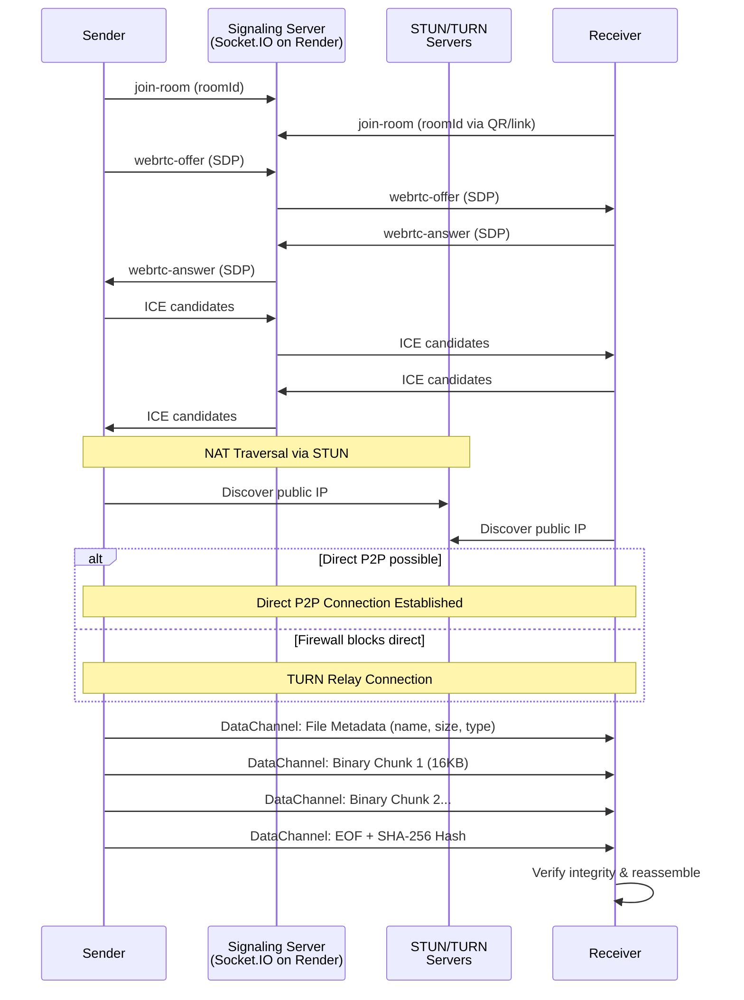
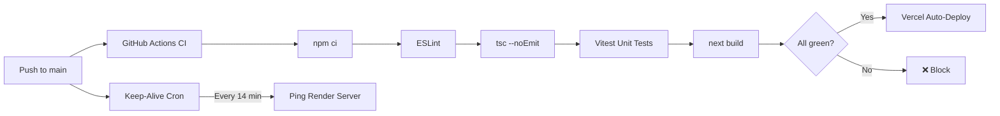
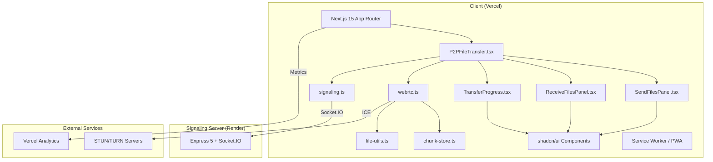

# Architecture Overview

## High-Level Design

TransmitFlow is a hybrid architecture:
1.  **Signaling Server (Socket.IO):** Lightweight broker for initial handshake.
2.  **Peer-to-Peer Data Channel (WebRTC):** Heavy lifting for file transfer (bypasses server).

## Signaling Server (`signaling-server.js`)
- **Runtime:** Express 5 + Socket.IO 4.8, deployed on Render (free tier).
- **Role:** Exchange SDP offers/answers and ICE candidates between peers.
- **Data Privacy:** Does NOT see file contents. Only relays small JSON signaling packets.
- **Security:**
  - Per-IP and per-socket rate limiting.
  - Room validation and role authorization (sender/receiver).
  - Payload size limits on all events.
  - Strict CORS allowlist in production.
  - Health endpoint split: public `/health` + token-protected `/health?diagnostics=true`.
  - Volatile memory only (no database, rooms expire on disconnect).
- **Keep-Alive:** GitHub Actions cron pings every 14 minutes to prevent Render spin-down.

## Client Application (Next.js)
- **Framework:** Next.js 15.5.12 with App Router and Turbopack.
- **UI:** React 19.1.0 + Tailwind CSS + shadcn/ui (Radix primitives).
- **State Management:** React hooks + transfer state machine in `P2PFileTransfer.tsx`.
- **QR Scanning:** `@yudiel/react-qr-scanner` (uses `zxing-wasm` for barcode detection).
- **QR Generation:** `qrcode` library generates data URLs for room share links.
- **PWA:** Service worker (`sw.js`) + web manifest for offline support and installability.
- **Analytics:** Vercel Analytics & Speed Insights.
- **Deployment:** Vercel (auto-deploy from GitHub `main` branch).

## WebRTC Implementation Details (`webrtc.ts`)
- **ICE Servers:** Configurable STUN/TURN servers via environment variables; defaults to Google STUN + multi-TURN failover.
- **Data Channels:**
    - Control channel: Text-based signaling messages (metadata, progress, ack, error).
    - Transfer channel: Binary-mode channel for raw chunk stream.
- **Chunk Size:** 16KB (safe default for WebRTC interoperability).
- **Backpressure:** Monitors `bufferedAmount` to prevent flooding the data channel.
- **Integrity:** SHA-256 hash verification after transfer completion.
- **Persistence:** IndexedDB-backed chunk storage (`chunk-store.ts`) for large files.
- **Recovery:** Missing-chunk detection and retry flow.

## Security Model
See [SECURITY.md](../SECURITY.md) for full policy.
1.  **Ephemeral Rooms:** Rooms exist only in server memory, expire on disconnect.
2.  **CSPRNG Room Codes:** `crypto.getRandomValues` for 8-character alphanumeric codes.
3.  **Filename Sanitization:** Special characters stripped before display/download.
4.  **Content Security Policy:** Strict CSP in production (connect-src allowlist, script-src, etc.).
5.  **CORS:** Strict origin allowlist for signaling server.
6.  **Production Log Hygiene:** Sensitive runtime context suppressed in production builds.
7.  **Browser Security Headers:** X-Frame-Options, X-Content-Type-Options, Referrer-Policy, HSTS, Permissions-Policy.

## CI/CD Pipeline

## Project Structure

