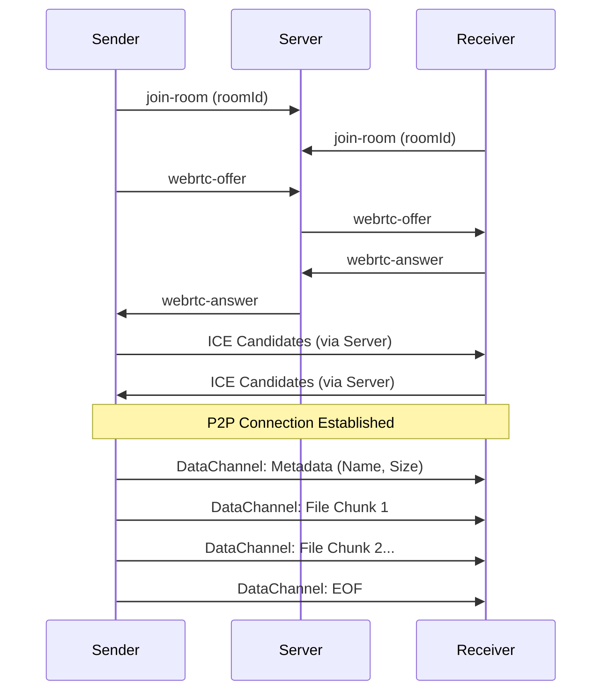

# Architecture Overview

## High-Level Design

TransmitFlow is a hybrid architecture:
1.  **Signaling Server (Socket.IO):** Lightweight broker for initial handshake.
2.  **Peer-to-Peer Data Channel (WebRTC):** Heavy lifting for file transfer (bypasses server).

## Signaling Server (`server1.js`)
- **Role:** Exchange Session Description Protocol (SDP) and ICE candidates.
- **Data Privacy:** Does NOT see file contents. Only "blindly" relays small JSON packets.
- **Security:**
  - Rate limited per IP.
  - Room validation (ensure sender is in room).
  - Volatile memory only (no database).

## Client Application (Next.js)
- **Framework:** Next.js 14+ (React).
- **Styling:** Tailwind CSS + Radix UI.
- **State Management:** React Context + `useReducer` for complex transfer states.

## WebRTC Implementation Details
- **ICE Servers:** Uses public STUN servers (Google) to punch holes in NATs.
- **Data Channels:**
    - `signaling`: Text-based control messages (metadata, progress, ack).
    - `transfer`: Binary binary-mode channel for raw chunk stream.
- **Chunk Size:** 16KB (safe default for interoperability).
- **Backpressure:** Monitors `bufferedAmount` to prevent flooding the channel.

## Security Model
See [SECURITY.md](../SECURITY.md) for full policy.
1.  **Ephemeral Rooms:** Rooms exist only in server memory.
2.  **Code Hardening:** `crypto.getRandomValues` used for 6-digit codes.
3.  **Sanitization:** Filenames specially char-stripped before display.
4.  **CORS:** Strict origin policies in production.
