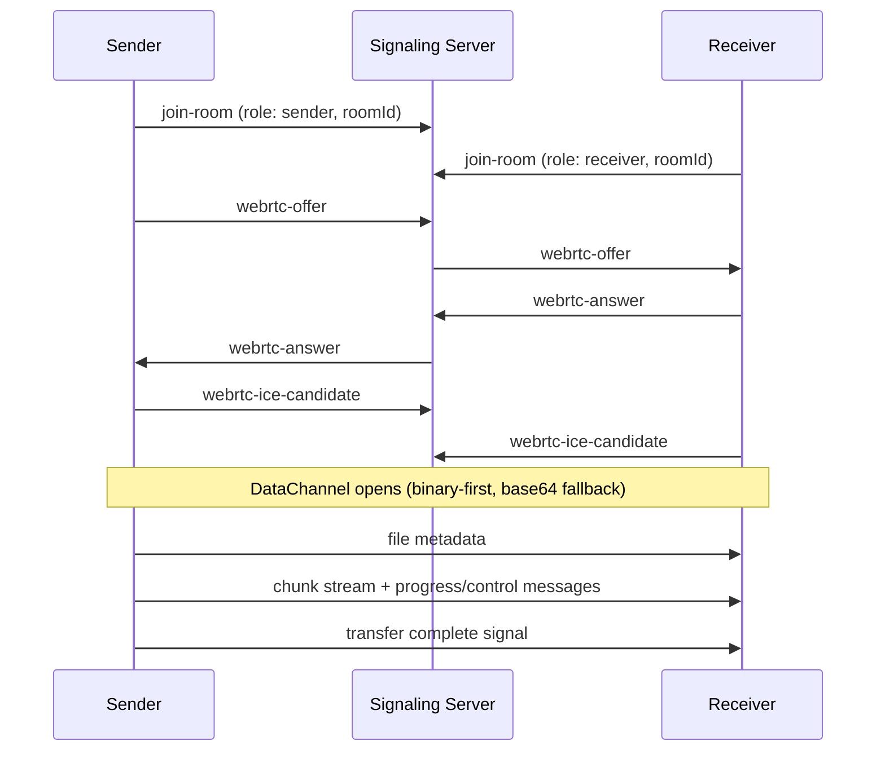

# Architecture Overview

## System Model

TransmitFlow uses a split architecture:

1. **Signaling server (`signaling-server.js`)** for room coordination and WebRTC handshake exchange.
2. **Direct peer-to-peer WebRTC DataChannel** for actual file payload transfer.

The signaling server relays only control messages (room join, SDP, ICE, transfer lifecycle events). It does not store transferred file data.

## End-to-End Connection Flow



## Client Runtime Architecture

### UI Composition

- `src/components/P2PFileTransfer.tsx` is now a composition layer.
- Landing sections are split into dedicated components in `src/components/landing/`:
  - `LandingNavbar.tsx`
  - `LandingHeroSection.tsx`
  - `LandingHowItWorksSection.tsx`
  - `LandingFeaturesSection.tsx`
  - `LandingSupportSection.tsx`
  - `LandingFooter.tsx`
- Transfer-state rendering is delegated to `TransferProgress.tsx`.

### State + Orchestration

- `src/components/hooks/useP2PTransferController.ts` owns transfer orchestration.
- The hook manages:
  - connection/reconnect status,
  - room-code and role flows (`send` / `receive`),
  - transfer state machine (`idle`, `connecting`, `transferring`, terminal states),
  - retries/reset/cancel behavior,
  - toasts and lifecycle synchronization with signaling + WebRTC services.

## Core Service Layers

### `src/lib/signaling.ts`

Socket.IO client abstraction for:

- connecting/disconnecting,
- room join/leave,
- transfer lifecycle emits,
- offer/answer/ICE event forwarding,
- dynamic TURN server updates.

### `src/lib/webrtc.ts`

WebRTC engine responsibilities:

- sender/receiver role initialization,
- binary transfer path with adaptive chunk sizing (typically 64KB/128KB modes),
- base64 compatibility fallback path,
- backpressure handling using channel buffered amount,
- completion checks and transfer error propagation,
- local chunk persistence through `chunk-store.ts`.

### `src/lib/file-utils.ts`

Utility layer for:

- room code generation,
- file size formatting,
- filename sanitization,
- browser download triggering.

Current room code length is **4 characters**.

## Signaling Server Responsibilities

`signaling-server.js` handles:

- room lifecycle in memory,
- role-based event authorization (`sender` / `receiver`),
- strict payload validation and size limits,
- abuse controls (per-socket/per-IP rate limits),
- dynamic STUN/TURN configuration delivery,
- health and diagnostics endpoints:
  - `GET /health`
  - `GET /health/diagnostics` (token-protected in production)

## Transfer Lifecycle (Contributor View)

1. Sender selects files and creates room code.
2. Receiver joins room code.
3. Signaling exchange establishes peer connection.
4. DataChannel opens; file metadata is announced.
5. Chunks stream with per-file progress updates.
6. Completion/cancel/error terminal state is emitted and surfaced in UI.

## Current Project Layout (Relevant Paths)

```text
src/
  app/
  components/
    hooks/
      useP2PTransferController.ts
    landing/
      LandingNavbar.tsx
      LandingHeroSection.tsx
      LandingHowItWorksSection.tsx
      LandingFeaturesSection.tsx
      LandingSupportSection.tsx
      LandingFooter.tsx
    P2PFileTransfer.tsx
    SendFilesPanel.tsx
    ReceiveFilesPanel.tsx
    TransferProgress.tsx
  lib/
    signaling.ts
    webrtc.ts
    file-utils.ts
    chunk-store.ts
docs/
  ARCHITECTURE.md
  browser-support.md
signaling-server.js
```

## Contributor Notes

- Keep business logic in `useP2PTransferController.ts`; keep `P2PFileTransfer.tsx` declarative.
- Avoid adding transfer orchestration directly into presentational landing components.
- Changes to signaling payloads must be mirrored on both `signaling-server.js` and `src/lib/signaling.ts`.
- For transfer-flow fixes, validate both sender and receiver paths and terminal state transitions.
